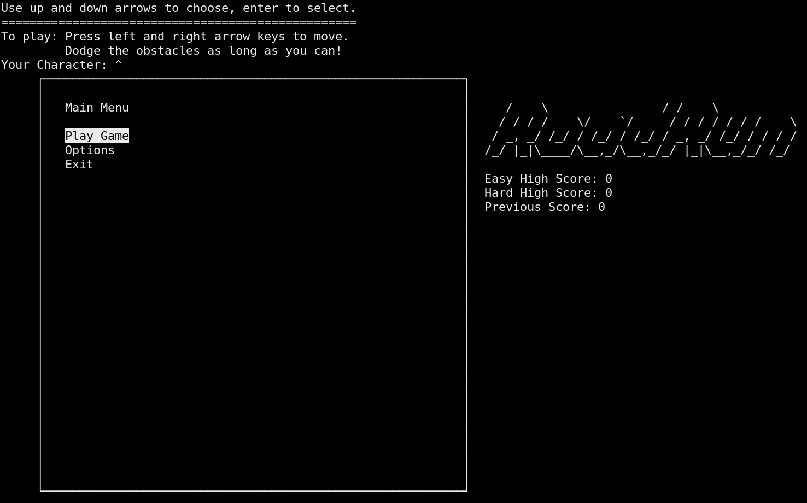

# RoadRun
An obstacle avoidance game in C++ using object oriented design principles.



## How to Run
Make sure [NCurses](https://invisible-island.net/ncurses/man/ncurses.3x.html) is [installed](https://www.cyberciti.biz/faq/linux-install-ncurses-library-headers-on-debian-ubuntu-centos-fedora/) with this commmand:
```
sudo apt-get install libncurses5-dev libncursesw5-dev
```
Compile and run with this command:
```
make run
```

## How to Play
- Select "Play Game" to start a new game
- Use left and right arrow keys to move your character: `^`
- Don't hit anything!

## Acknowledgements
- SJSU's CMPE 135 Class taught by professor [Ron Mak](http://www.cs.sjsu.edu/~mak/CMPE135/index.html) for inspiration for this project.
- All contributors
- Everyone who helped play test
